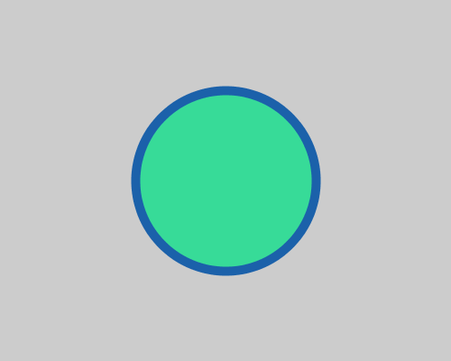

#Color01:線

**stroke()**関数は線の色を変更することができます。

**stroke(R, G, B)**

```java
//Example: stroke

size(500,400); // size of canvas

fill(55,219,152); //change fill color

stroke(27,97,170);  //change path color
strokeWeight(10);  //change path width
//noStroke();  //stroke off

ellipse(250,200,200,200); // draw circle
```
実行結果↓


また、上記の例には線幅を変更する関数と線を消す関数(コメントにより無効になっています)も書き込まれています。

###線幅
**strokeWeight()**は線幅を変更する関数です。線幅をピクセルで指定します。

**strokeWeight(線幅)**

### 線無し
**noStroke()**関数を使うと以降の図形は輪郭線無しで描画されます。
