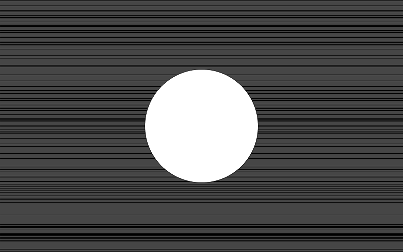

**draw()**の中で、単純に円や線をランダムな位置に描くと、毎ループ位置が変わる為すごくせわしなくなる。紙芝居みたいに数秒ごとに背景を切り替えつつ、手前にあるオブジェクトは常に動き続けるには、

プログラム開始からの経過時間を返してくれる関数 **millis()** と、

ランダム関数 **random()** の値を整える関数 **randomSeed()**

組み合わせで実現できる。

```java
int interval = 2000; //5000 msec = 5sec
int timeStamp = 0; //jikan kiroku

int d = 0; //ball no chokkei

void setup(){
 size(800,500);
}

void draw() {
  background(70);

  //5sec tattara haikei kakikae
  if((millis()-timeStamp) >= interval){
    timeStamp = millis();
  }

  //haikei kaku
  randomSeed(timeStamp); //random no kazu syokika
  for(int i=0; i<100; i++){
    float y = random(height);
    line(0,y,width,y);
  }

  //maru fukumaseru
  ellipse(width/2,height/2,d,d);
  d = d+1;
  if(d > (height*0.8)){
    d = 0;
  }
}
```

実行結果　↓

