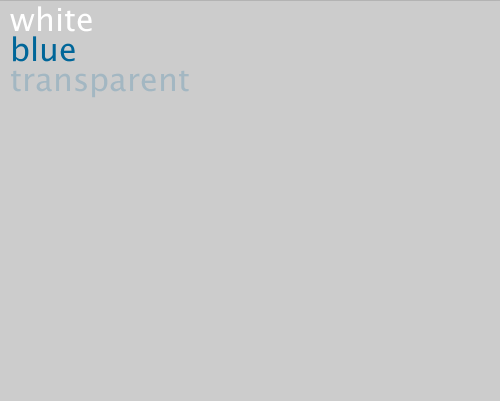

#テキストを使う

text()関数でキャンバス内に文字を表示することも可能です。

**text("表示したい文字", 文字の左上のX座標, 文字の左上のY座標);**

というように使います


```java
//Example: text

void setup() {
  size(500, 400);
}

void draw() {
  background(204);

  textSize(32);
  fill(255);
  text("white", 10, 30);
  fill(0, 102, 153);
  text("blue", 10, 60);
  fill(0, 102, 153, 51);
  text("transparent", 10, 90);
}
```
実行結果↓

