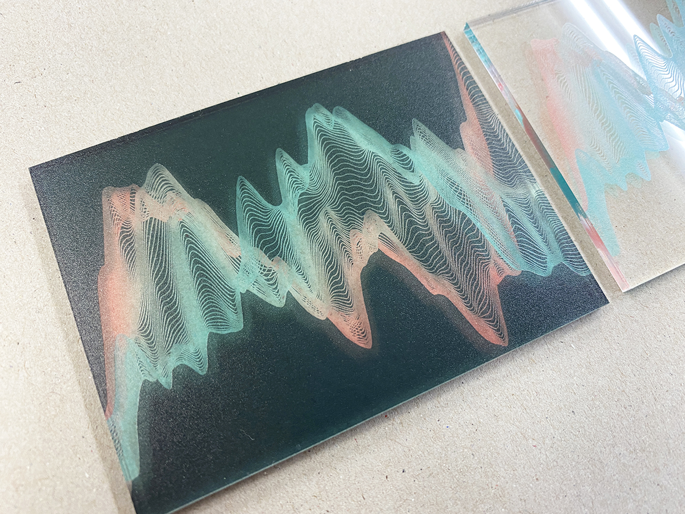
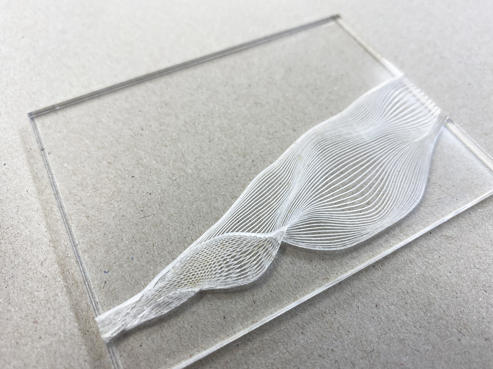

# Export SVG - SVGデータ出力
Processingで描画したグラフィックを、素材として他のソフトウェアで使用したり、マシンで加工するために
ベクターデータとして書き出すこともできます。
下記のコードを実行すると、Processingファイルの入ったフォルダに"filename.svg"という名前でSVGファイルが
書き出されれます。書き出されたSVGファイルをブラウザで開いて、中身を確認してみましょう。

#### サンプルコード
```java
import processing.svg.*;

void setup() {
  size(400, 400);
  noLoop();

}

void draw() {
  beginRecord(SVG, "filename.svg");
  // use background() here
  // Draw something good here
  line(0, 0, width/2, height);

  endRecord();
}
```

## マシンへの出力
Processingで書き出したSVGファイルを、UVプリンタやレーザーカッターなどのデジタル工作機器にわたして、
ディスプレイではなく、アクリルや木板などの物体に出力(印刷)してみると、また一味違った作品になります。

UVプリント


レーザー彫刻
※切断線を貫通させず、あえて表面にケガキ線が残るように弱いパワーで加工


UVプリントに関しては、線、塗り共にこれといって制限はありません。
レーザー加工に関しては、各オブジェクトの色を以下のようにしておく必要があります。

#### 上記の写真のように、SVGの線に沿ってレーザーが動き、カットまたはケガキして欲しい場合：
```java
/// for cutting 切断したい線
noFill();
strokeWeight(0.003);
stroke(255,0,0);
```

#### 色がついた領域をカットではなく、レーザー彫刻して欲しい場合：
```java
/// for engraving　彫刻したい部分
noStroke();
fill(0,0,0);
```
