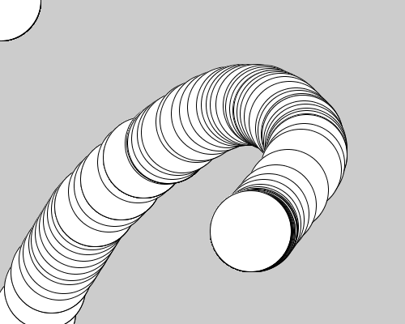

# Interact : インタラクション
マウスの位置によってグラフィックを変化させ、インタラクティブにしてみましょう。

```java
//Example: mouse position

void setup(){
  size(500,400);
}

void draw(){
  ellipse(mouseX, mouseY, 100, 100);
}
```
実行結果↓


###setup()とdraw()
Processingでの基本的なコードの書き方として、
**setup()とdraw()という２つのグループに分けて命令を書く**
と言うものがあります。どちらの命令も命令の前に**void**がつき、命令にの**()**の後に**{}**が続きます。この**{}**内にコードを書いていくのですが...

```java

void setup(){
  ・・・ここに書かれた命令は最初に１回だけ行われます。・・・
}

void draw(){
・・・ここに書かれた命令はプログラムを走らせている間は繰り返し行われます・・・
}
```
といった違いがあります。主にsetup()内では、size()などのスタート時に１回しか行う必要のない命令を入れておき、
draw()内には、グラフィックの描画や値の計算など、更新し続ける必要がある命令を書き込みます。

###変数
ellipse()関数のX座標とY座標を指定する場所に、

**mouseX:マウスカーソルのX座標
mouseY:マウスカーソルのY座標
**

を書き込んでいます。このようにProcessingにはあらかじめ決められた名前があり,それによってマウスの位置や押されているキーボードの文字などを取得することができます。

こういった、変動する数値の入れ物を**変数**と呼びます。

###描画リセット
上記のプログラムでは過去に書いた円も画面に残り続けてしまいます。最新の円のみを描画したい場合はdrawの最初に**background()**を入れてみましょう。

```java
//Example: reset background

void setup(){
  size(500,400);
}

void draw(){
  background(204);
  ellipse(mouseX, mouseY, 100, 100);
}
```
#####**background()**は背景の色を変更するというよりかは、キャンバス全面を指定した色で塗りつぶす機能だということがわかります
