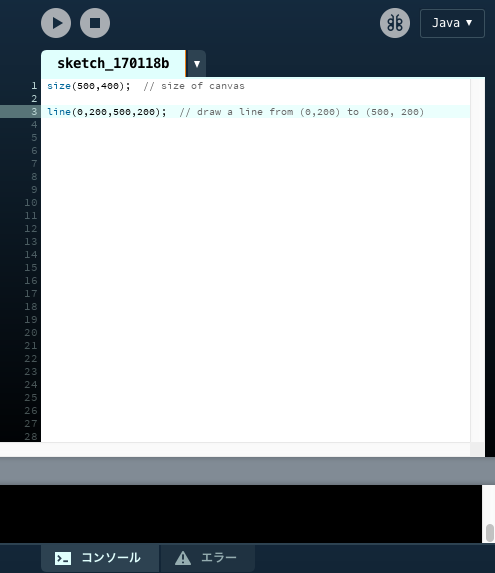
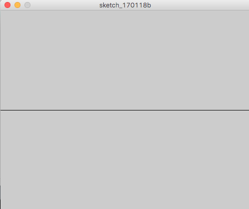

# Shapes : 図形

まずは、下のコードをProcessingにコピー&ペーストして、

```java
size(500,400);  // size of canvas

line(0,200,500,200);  // draw a line from (0,200) to (500, 200)
```




画面左上にある実行\(RUN\)ボタンを押します

すると書いたプログラムが実行され下のようなウィンドウが表示されます



# まずは最初のコード完成おめでとうございます！

...次のページでは一体何が起こっているのか説明していきます

### •実行\(RUN\)にはショートカットキーも

### Mac：⌘ + R

### Windows：Ctrl + R

### •実行ウィンドウは閉じるボタンで停止することができますが、ESCキーでも停止可能です
