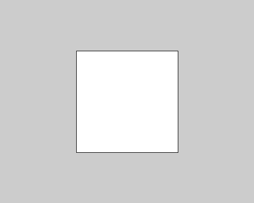
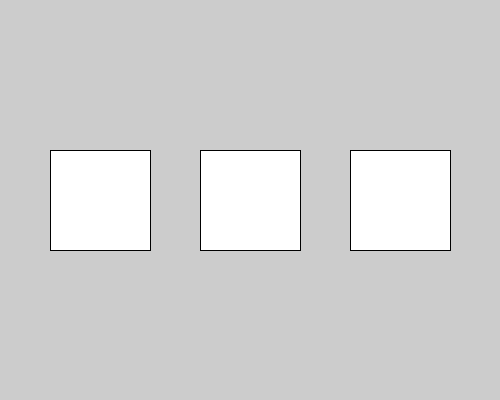
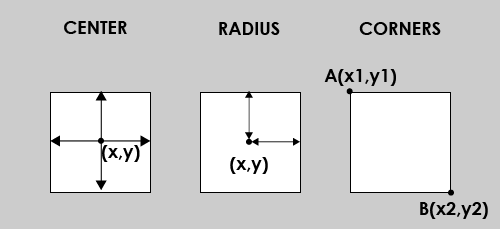

# Shape03:長方形を描く
長方形を描くための関数**rect()**を使って
シンプルな正方形を描いてみましょう。

```java
size(500,400);  // size of canvas

// draw a rectangle, top-left is (150,100), width=200, height=200
rect(150,100,200,200);
```
結果↓



関数rect()は通常以下のように使います

**rect(左端のX座標, 上端のY座標,　長方形の幅,　長方形の高さ);**

...このコマンドについてもう１つ例を見てみましょう

```java
size(500,400);  // size of canvas

rectMode(CENTER);
// draw a rectangle, center is (150,200), width=100, height=100
rect(100,200,100,100);

rectMode(RADIUS);
// draw a rectangle, center is (250,200), half of width=50, halof of height=50
rect(250,200,50,50);

rectMode(CORNERS);
// draw a rectangle, one corner is (350,150), another-corner is (450,250)
rect(350,150,450,250);

//if you wanna go back to default, use rectMode(CORNER)
```

結果↓



一見同じ様な正方形が３つ並んでいるように見えますが、実はひとつづつ異なるrect()の使い方で描画されています。

rectMode()と言う関数を使うと、異なる引数で長方形が描けるようになるのです。

左から順に説明していくと...

**rectMode(CENTER);**という行以降では
**rect(中心のX座標, 中心のY座標, 長方形の幅, 長方形の高さ);**
※最初のモードとほぼ同じですが中心の座標を指定します

**rectMode(RADIUS);**という行以降では
**rect(中心のX座標, 中心のY座標,　長方形の幅/2,　長方形の高さ/2);**
※中心座標を基準に幅と高さを半径で指定します

**rectMode(CORNERS);**という行以降では
**rect(点AのX座標, 点AのY座標, 点BのX座標, 点BのY座標);**
※点Aと点Bが対角関係にある直角長方形を描きます

######デフォルトに戻したい場合は、rectMode(CORNER);


