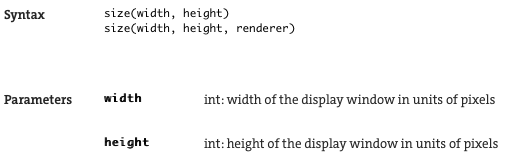
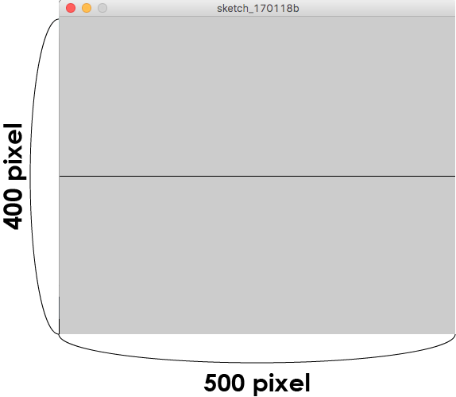

# Shapes00:プログラムの基礎

**祝！初プログラミング達成！**

ですが、ここで実際何が起こっていたのか、順を追ってチェックして、プログラミングの基礎に触れてみましょう

## 【上から下に】

パソコンにやってほしい事を伝えるための命令書のことを**プログラム\(Program\)**とか**コード\(Code\)**と呼びます

パソコンは、基本的にコードに書かれている**命令を上から順に実行します**

なので、さっきの例のコードでは...

```java
size(500,400);  // この行が最初に実行され。

line(0,200,500,200);  // こっちの行が２番めに実行されます。
```

\(ちなみに **// **のあとに続く文はコメントといって、人間のためのメモ用テキストになりパソコンには無視されます\)

#### 【関数\(function\)】

では、それぞれの行はどんな命令を実行していたのでしょうか？

まず一行目のこの部分を見ていきましょう。

```java
size(500,400);  // size of canvas
```

Processingで使う多くの命令は以下のようになっています↓  
**  
命令の名前\(引数1,引数2,....\);**

まず命令の名前が最初に来て、次に引数が**\(\)丸括弧**の中に** , カンマ**で隔てられて詰め込まれています

\(引数の個数は命令によって異なります\)

そして行末には** ;ダブルコーテーション**がついてこれがこの１つの命令の終わりだよと示しています

プログラミングでは、こういった形式の命令を**関数\(function\)**と呼びます

つまりここでは、

**関数名：size**

**引数1 : 500**

**引数2 : 400**

となっています


#### 【size = キャンバスを作る】

でも、結局sizeって関数がどういう命令なのかまだ分かっていません

そんな時は、[**Processing公式サイトのReferenceページ**](https://processing.org/reference/)を参照してみましょう！

Processingで使える命令の一覧表がズラッと出てきて各命令の機能も事細かに記載されています。  
早速、[**size\(\)のページ**](https://processing.org/reference/size_.html)を見てみると**Description**という項目のところに、『ウィンドウのサイズを定義する命令』という説明書きがあります。つまり、命令を実行した時に出るウィンドウ↓


このサイズを決めるための関数だったのです。  
そしてページの情報を読み進めていくと、  



と、書かれており
**width**の部分に横幅
**height**の部分に縦幅
をそれぞれピクセル数で書き込むとのことなので、

```java
size(500,400);
```
と書き込めば、幅500ピクセル x 高さ400ピクセルのウィンドウが表示されます。



Processingでは、まずこのsize()関数を使ってウィンドウを作り、その中に様々な命令を使ってグラフィックを描いていきます。
