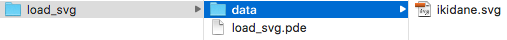

#SVG:ベクターデータの読み込み
イラストレータで作ったデータを読み込ませることも可能です。
SVG形式でデータ保存して、プログラムフォルダの中にSVGデータを置きます。

フォルダの構造としてはこのような感じになっております↓


(わかりやすさのためにdataフォルダを作っています)


```java
//Example: svg

PShape s;

void setup() {
  size(500,400);
  s = loadShape("data/ikidane.svg");
}

void draw() {
  background(204);
  shape(s);
}

void mousePressed() {
  // Move the shape 10 pixels right each time the mouse is pressed
  s.translate(10, 0);  
}
```
実行結果↓


