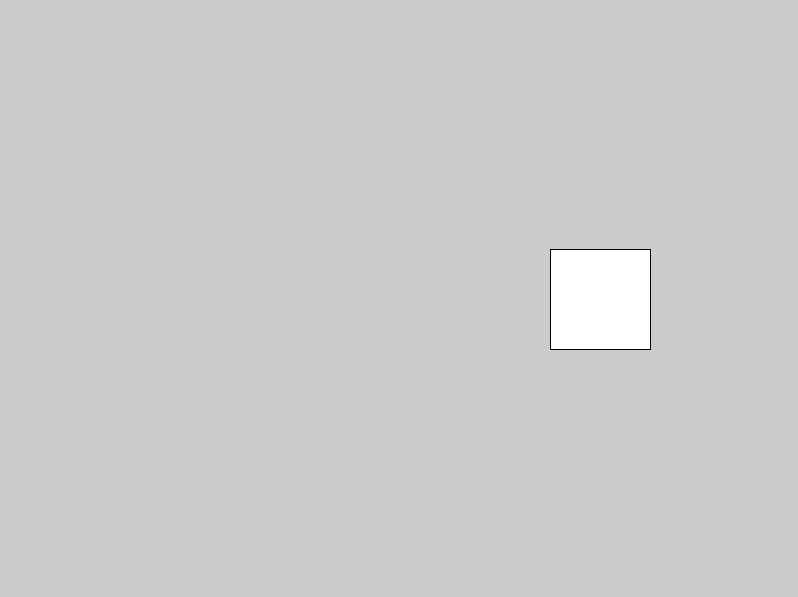
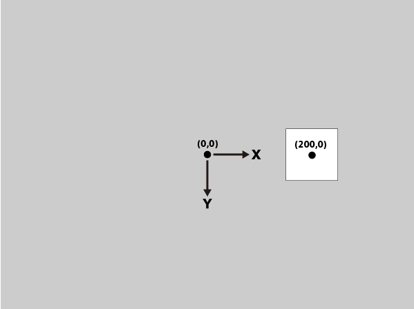
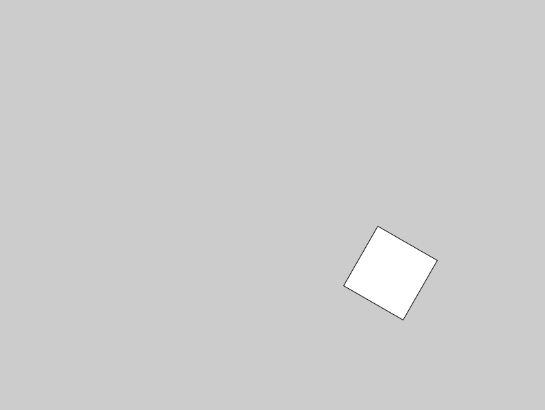
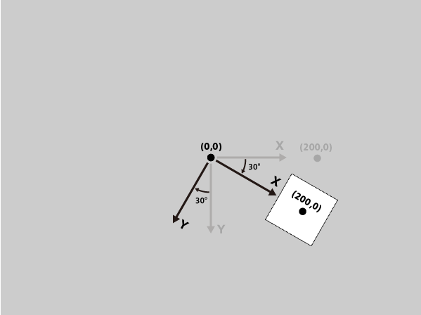
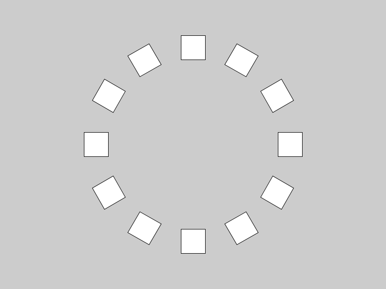

# Rotate - 原点を回転する

**rotate()** 関数を使えば、原点を中心にX軸とY軸の方向を変えることが出来る。

**rotate(回転させたい角度);　　※角度はラジアン指定**

例えば、以下のようなプログラムを走らせたときに、


```java
void setup(){
  size(800,600);
  rectMode(CENTER);
  noLoop();
}

void draw(){
  translate(width/2, height/2); //原点をキャンバス中央に移動

  rect(200,0,100,100); //原点からX方向に200離れた位置を中心に四角形を描く
}
```

実行結果はこうなる。



最初のtranslate()で、原点がキャンバスの中心に移動しているため、

(200,0)を中心に描いた四角形は、図の位置に描画される。



次に、四角形を描く前に **rotate()** 関数をいれてみる。

```java
void setup(){
  size(800,600);
  rectMode(CENTER);
  noLoop();
}

void draw(){
  translate(width/2, height/2); //原点をキャンバス中央に移動

  rotate(PI/6); // X軸＆Y軸をPI/6 = 30°傾ける

  rect(200,0,100,100); //原点からX方向に200離れた位置を中心に四角形を描く
}
```

すると結果はこう変化する。



rotate()により、原点を中心に時計回りにX軸とY軸が30°回転したため、

数値は同じでも、描画される方向がずれた。



またrotate()による回転も、pushMatrix()とpopMatrix()で元に戻すことが出来るため。

オブジェクトを以下のように環状に配置することも可能。


```java
float theta = 0;
int item_number = 12;

void setup() {
  size(800, 600);
  rectMode(CENTER);
  noLoop();
}

void draw() {
  translate(width/2, height/2);

  for (int i = 0; i < item_number; i++) {
    pushMatrix();
    theta = TWO_PI/item_number * i;
    rotate(theta);
    rect(200, 0, 50, 50);
    popMatrix();
  }
}
```

結果画像↓

